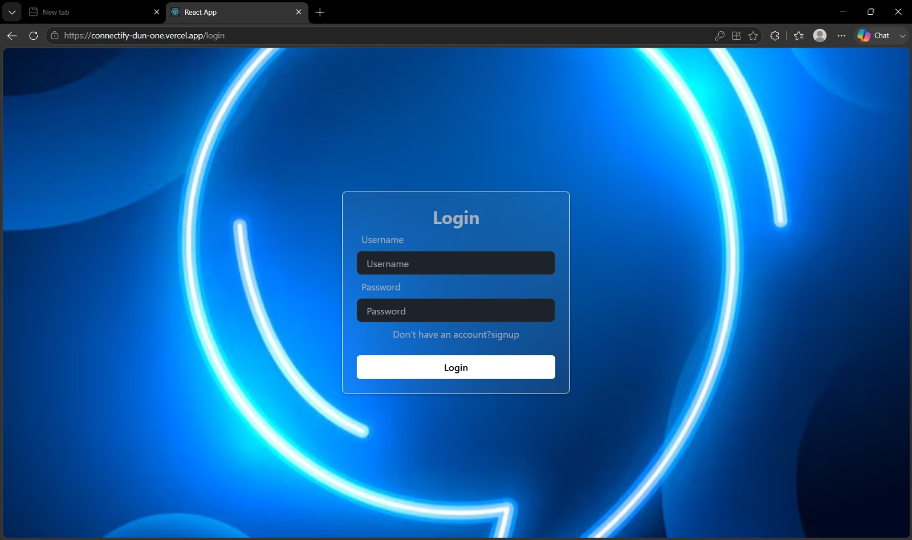
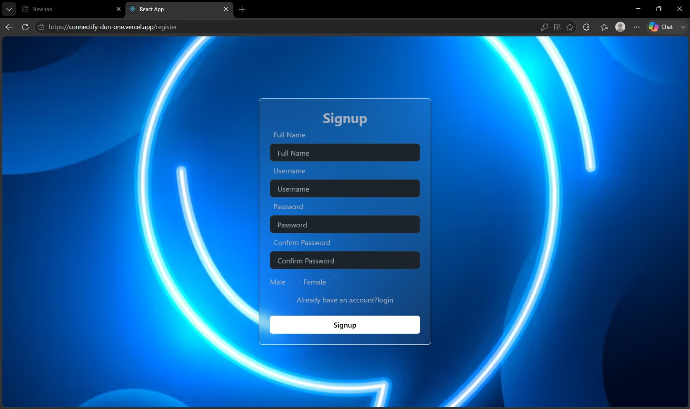
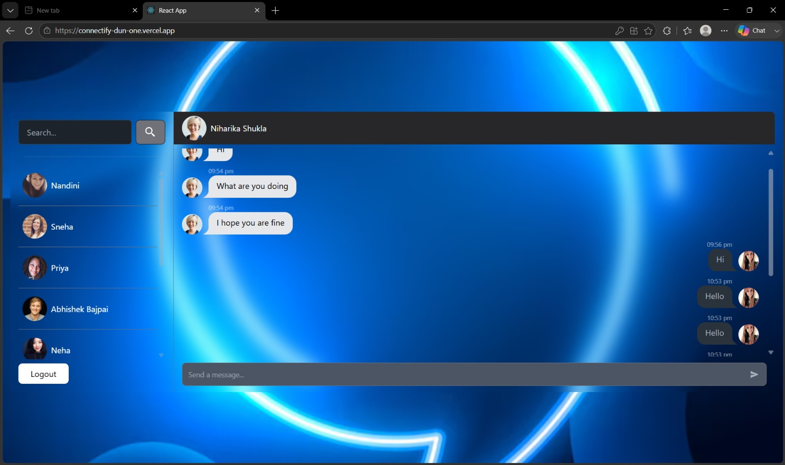

# 💬 Connectify

A full-stack **real-time chat application** built with the MERN stack and Socket.io. Connectify lets users sign up, log in, and exchange messages instantly with other registered users — no page refresh required.


### 🔗 [Live Demo](https://connectify-dun-one.vercel.app) &nbsp;|&nbsp; Backend: [API Server](https://connectify-xog9.onrender.com)

> ⚠️ Note: The backend is hosted on Render's free tier, which spins down after inactivity. The first request after idle time may take 30–50 seconds to respond.

---

## 📸 Screenshots

| Login | Signup | Chat |
|---|---|---|
|  |  |  |

---

## ✨ Features

- 🔐 **Secure Authentication** — JWT-based login/signup with hashed passwords (bcrypt)
- ⚡ **Real-Time Messaging** — instant message delivery powered by Socket.io
- 👥 **User List** — browse and start conversations with other registered users
- 🍪 **Persistent Sessions** — HTTP-only cookies keep users logged in
- 🎨 **Modern UI** — responsive interface built with Tailwind CSS and DaisyUI
- 🗃️ **State Management** — Redux Toolkit with redux-persist for a smooth client experience

---

## 🛠️ Tech Stack

**Frontend**
- React 19
- Redux Toolkit + Redux Persist
- React Router DOM
- Socket.io-client
- Tailwind CSS + DaisyUI
- Axios, React Hot Toast

**Backend**
- Node.js + Express 5
- MongoDB + Mongoose
- Socket.io
- JSON Web Token (JWT) for auth
- bcryptjs for password hashing
- cookie-parser, cors, dotenv

---

## 📁 Project Structure

```text
connectify/
├── Backend/
│   ├── config/          # Database connection setup
│   ├── controllers/     # Request handlers (user, message)
│   ├── middleware/       # Auth middleware
│   ├── models/           # Mongoose schemas (User, Message, Conversation)
│   ├── routes/           # API routes
│   ├── socket/           # Socket.io setup
│   └── index.js          # App entry point
└── frontend/
    ├── public/
    └── src/
        ├── components/    # React components (Login, Signup, Sidebar, Chat, etc.)
        ├── hooks/         # Custom hooks (messages, real-time updates, users)
        ├── redux/         # Redux slices and store
        └── App.js
```

## 🚀 Getting Started

### Prerequisites

- [Node.js](https://nodejs.org/) (v18+ recommended)
- A [MongoDB](https://www.mongodb.com/) database (local or Atlas)

### 1. Clone the repository

```bash
git clone https://github.com/nikishukla319-ai/connectify.git
cd connectify
```

### 2. Set up the Backend

```bash
cd Backend
npm install
```

Create a `.env` file inside `Backend/` with the following variables:

```env
MONGO_URI=your_mongodb_connection_string
JWT_SECRET_KEY=your_jwt_secret_key
CLIENT_URL=http://localhost:3000
port=5000
```

Run the backend server:

```bash
npm run dev     # development (with nodemon)
npm start        # production
```

### 3. Set up the Frontend

```bash
cd ../frontend
npm install
npm start
```

The app will be available at `http://localhost:3000`, with the backend running at `http://localhost:5000`.

---

## 🔌 API Endpoints

**User routes** — `/api/v1/user`
| Method | Endpoint | Description |
|--------|----------|-------------|
| POST | `/register` | Register a new user |
| POST | `/login` | Log in an existing user |
| GET | `/logout` | Log out the current user |
| GET | `/` | Get list of other users (auth required) |

**Message routes** — `/api/v1/message`
| Method | Endpoint | Description |
|--------|----------|-------------|
| POST | `/send/:id` | Send a message to a user (auth required) |
| GET | `/:id` | Get conversation with a user (auth required) |

---

## 🤝 Contributing

Contributions, issues, and feature requests are welcome!

1. Fork the project
2. Create your feature branch (`git checkout -b feature/amazing-feature`)
3. Commit your changes (`git commit -m 'Add some amazing feature'`)
4. Push to the branch (`git push origin feature/amazing-feature`)
5. Open a Pull Request

---

## 📄 License

This project is currently unlicensed. Feel free to add a `LICENSE` file (e.g. MIT) if you'd like others to reuse the code.
